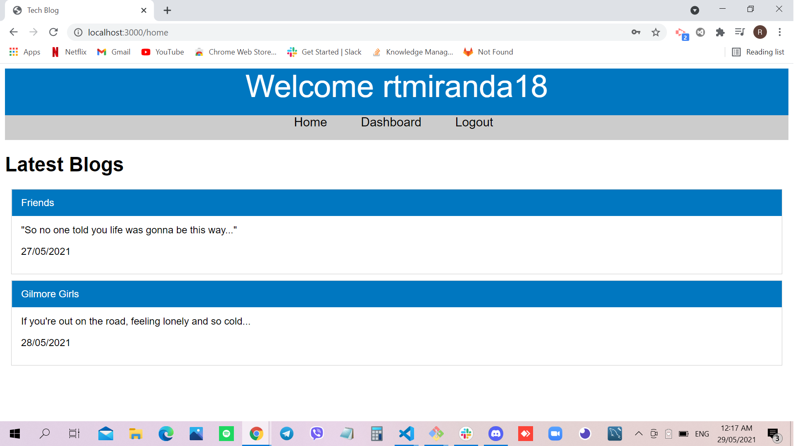

# MVC: Tech Blog

## Site Picture


## Technologies Used
- Javascript - adds special effects on pages
- Node.js - an open source server environment that uses JavaScript on the server
- MySQL - fully managed database service to deploy cloud-native applications.
- Handlebars - compiles templates into JavaScript functions
- GitBash - for cloning repository and pushing code to GitHub
- GitHub - holds repository that deploys to GitHub Pages

# Summary
This file contains code that uses MVC to generate a Tech Blog. It also contains code that was created using Javascript, Handlebars and Node.js. 

## Code Snippet
```javascript
app.route('/login')
    .get((req, res) => {
        if(!req.session.user && !req.cookies.user_sid){   
            res.render('login', hbsContent);
        }else{
            res.redirect('/');
        }
    })
    .post(async (req, res, next) => {
        try {
            let username = req.body.username;
            let password = req.body.password;
            await User.findOne({ where: {username: username} }).then(user => {
                if(!user || !user.validPassword(password)){
                    res.redirect('/login');
                }else{
                    req.session.user = user.dataValues;
                    res.redirect('/home');
                }
            })
        } catch (err) {
            next(err);
        }
    });
```

```javascript
<javascript>

</javascript>
```
## Heroku Deployed URL
https://aqueous-oasis-03214.herokuapp.com/login

## Author Links 
[LinkedIn](https://www.linkedin.com/in/rosario-miranda-b81170132/)<br />
[GitHub](https://github.com/rtmiranda18)
